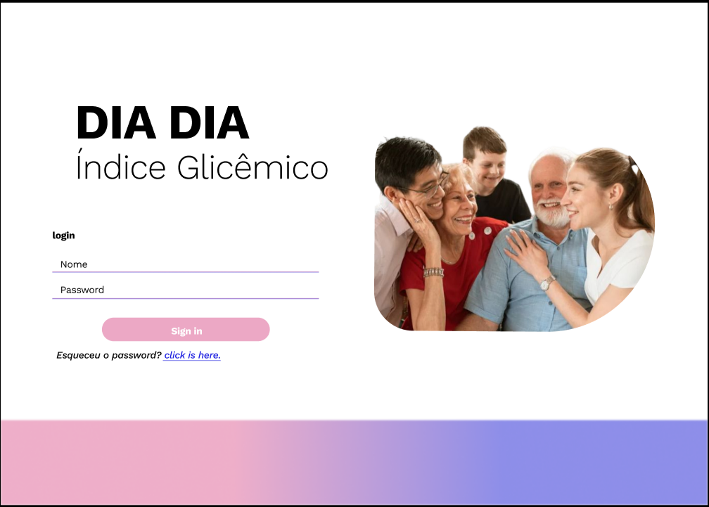

# Cronograma de Atividades 1° ETAPA #

## INÍCIO 10/2022.

# Cronograma de Atividades 2° ETAPA #

## INÍCIO 04/2023

### Curriculos do Programa da Graduação de Tecnologia e Sistemas para Internet - TSI que contemplados no projeto.

### Curriculos Não Técnicos:
* Metodologia do Trabalho Científico;
* Leitura e produção de Textos Acadêmicos;
### Curriculos Técnicos:
* Desenvolvimento Web - Front End;
* Desenvolvimento Web - Back End;
* Desenvolvimento de Sistemas Corporativos;
* Banco de Dados;
* Projetos de Software - APSWEB.
* Teste de Software;
* Desenvolvimento Mobile;

________________________________________
# PROTOTIPO #

## CLINICA (BROWSER) ##

### CLÍNICA LOGIN ### 

Tela de login, navegador para usuário-clínica.
   
    *   login
    *   Password
    *   Esqueci Password

## CLINICA DASHBOARD(BROWSER) ##

### DASHBOARD ###

Tela com recurso para uso da clínica.

  1. Menu Lateral:
    
    MENU
     
     * Emails (recursos terceiros)
     * Reports: Notificações de manutenção e bugs da aplicação.
     * Notificações: Atualizações e rotinas administrativas.
  
    ROTINAS

     * Chat APP: chat integrado a aplicação mobile.
     * Consultas: Cadastro, agendamento e pesquisa de Consultas Médicas.
     * Agendas Médicas: Cadastros, agendamento e pesquisa de agenda dos Médicos.

    OPÇÕES
   
     *  Configurações: Ajustes finos ( Tamanho da fonte, idioma...)

    SOBRE: Versão da Aplicação.

  2. Tela Principal:
    
    * Buscar: Pesquisa, recursos, usuários, clinícas (relacionados às cadastradas), convênios e médicos.
    * Seja Bem vindo: Usuário que está autenticado no sistema (logado).
    * Cadastrar Paciente: Cadastrar, remover e alterar pacientes para uso da aplicação mobile.
    * Pacientes: Gráficos e índices gerais da aplicação e seus cadastrados.
    * Total de Aferições: Atualizações referentes as aferições em tempo real de usuários, possível de verificação por usuário-paciente.
    * Médicos Disponíveis: Referente aos usuários-médicos possiveis de cadastro e agendamento para consultas futuras.
    * Ver todos: consulta e índices gerais( Com gráficos).
    * Consultas agendadas para hoje: lista de consultas agendas em tempo real, conforme o status de seus prosseguimentos. Exibe nome do paciente, horário de consulta, unidade de atendimento e médico agendado para aquela consulta.
___________________________________________________
## CADASTRO USUÁRIOS(BROWSER) ##

### DASHBOARD ###
Refere-se ao as descrições antes citadas.

Interface relacionada ao cadastro dos usuários-pacientes e seus relativos dados civis, diagnosticais e posiológicos.

_____________________________________________________

# USUÁRIO-PACIENTE (MOBILE) #

### PACIENTE LOGIN ###

Tela de login, navegador para usuário-paciente.
   
    *   login
    *   Password
    *   Esqueci Password
  
## INTEFACE AFERIÇÃO PACIENTE (MOBILE) ##

Interface de aferição do usuário para controle de índice glicêmico. Primeira tela caso o usuário-paciente tenha agendado tal rotina.

    * Verificar gráficos: botão de acesso aos índices anteriores, caso não haja aferições anteriores esse recurso não fica disponível.
    * Painel aferição: usuário deve digitar o índice relacionado ao seu nível glicêmico.
    * Enviar: Botão para confirma à aferição.
    * corrigir: Botão para correção, caso necessite.
  
## INTEFACE GRÁFICOS PACIENTE (MOBILE) ##

Interface de verificação de aferições, é exibido o gráfico que faz as medições em relação as alterações do índice glicêmico por período( semanais ou mensais, quando disponíveis.).

    * Agendar: Botão para agendamento de consultas ( Aplicações de terceiros.)
    * Painel Gráfico de aferições: exibe as aferições feitas pelo usuário-paciente e suas possíveis alterações.
    * Tabela Medições: exibe ao usuário-paciente uma lista de todas suas aferições(dia, hora e índice). Atualiza sempre que é feita uma nova aferição.
____________________________________________________________  
# MÉDICO(A) (BROWSER/MOBILE- RESPONSIVE) #

## MÉDICO LOGIN ##

Tela de login, navegador para usuário-médico.
   
    *   login
    *   Password
    *   Esqueci Password

## MÉDICO INTERFACE ##

Interface de consutal Usuário-Paciente. 
    * pesquisar paciente: Barra de pesquisa para consultar paciente e seus respectivos dados para consulta.
    * Nome e dados do paciente;
    * Medições: tabela com as aferições feitas pelo paciente e seus respectivos índices.
    * Gráfico de Índices Glicêmicos: Gráfico que expões as alterações glicêmicas do paciente, pode ser alterado sua peridiocidade.
    * Próximas Consultas: Tabela relacionada as próximas consultadas agendas pelo usuário-clínica, com os campos dia, hora e paciente.